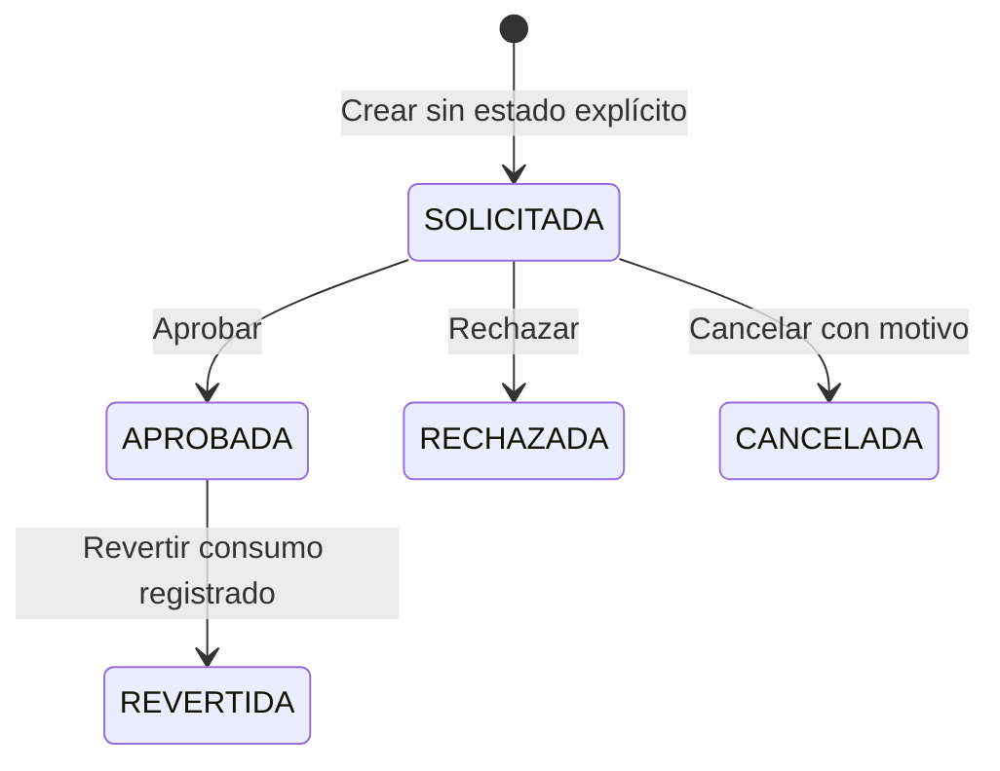

# Estado del módulo de Recursos Humanos (RRHH)

Fecha de revisión: **7 de octubre de 2026**.

Actualización de implementación: diez entregas incorporadas para solicitudes, saldos, movimientos, cancelación, reversión, ajustes, apertura, verificación con CSV, bandeja, historial, actividad, exportaciones y calendario de ausencias aprobadas. Consulte el [plan, sección 52](PLAN_MEJORAS_RRHH.md#52-décima-entrega-exportación-anual-del-libro-de-movimientos) para el último alcance y la sección 49 para el orden de las tres migraciones. Pendiente aceptación funcional y despliegue. El inventario contiene 109 endpoints declarados frente a 94 en la línea base.

## Alcance y criterio de evaluación

Inventario del backend de este repositorio, elaborado a partir de controladores, servicios, DTO, entidades, repositorios y scripts SQL. «Implementado» significa que existe código para la operación; no confirma que esté desplegada ni que sus tablas existan en producción. La primera entrega también revisa su pantalla Angular y se prueba con PostgreSQL temporal; no se ejecutó el servidor ERP ni se consultó la base productiva. No se calcula un porcentaje de avance porque no existe un alcance funcional aprobado con el que compararlo.

- **Implementado:** operación y servicio identificados en el código.
- **Parcial:** registro o consulta disponible, con operaciones del ciclo funcional ausentes en las rutas revisadas.
- **Solo consulta:** modelo persistente y lectura expuesta; sin escritura específica en la API revisada.
- **Por verificar:** requiere validación en ejecución, base de datos o frontend.

## Resumen del estado

El módulo incluye administración de empleados, selección e incorporación, desarrollo, compensación, bienestar, cumplimiento e indicadores. También contiene personal tradicional, catálogos, acciones de personal, expedientes y solicitudes de vacaciones, permisos y licencias.

Coexisten tres grupos de rutas:

1. API versionada `/api/v1/rrhh`, con entidades `Rrhh*` y tablas `rrhh_*`.
2. API de personal y talento humano `/api/personal`, catálogos `/api/*` y `/api/th-*`, con entidades `Personal` y `Th*`.
3. Controladores tradicionales `/personal`, `/cargos`, `/detcargo`, `/tpcontratos` y `/contemergencia`, en otro paquete.

Los servicios revisados no muestran una sincronización entre `rrhh_employees` y el personal tradicional, ni entre los registros de ausencias/acciones/archivos de V1 y los de `Th*`. No debe asumirse que una escritura en una familia aparece en la otra.

## Matriz de funcionalidades, acciones y cobertura

| área | Funcionalidad | Acciones expuestas | Estado de cobertura | Observación |
|---|---|---|---|---|
| Personal V1 | Ficha de empleado | Listar con filtros, consultar detalle, crear, actualizar, cambiar estado | Implementado | Valida duplicados de código, identificación y correo; valida fechas laborales. |
| Personal V1 | Contratos del empleado | Consultar historial | Solo consulta | Sin ruta específica para crear, renovar o terminar contratos. |
| Personal V1 | Expediente del empleado | Consultar archivos | Solo consulta | Sin carga o edición de documentos en V1. |
| Personal V1 | Ausencias del empleado | Consultar historial | Solo consulta | Sin creación ni aprobación en V1. |
| Personal V1 | Acciones del empleado | Consultar historial | Solo consulta | Sin escritura específica en V1. |
| Selección | Vacantes | Listar, crear, actualizar | Parcial | Registra etapa y estado; no hay operación específica de publicar/cerrar. |
| Selección | Candidatos | Listar, crear, actualizar | Parcial | Vincula vacante; registra etapa, puntuación y estado; controla identificación duplicada. |
| Selección | Entrevistas | Listar, crear, actualizar | Parcial | Registra fecha, entrevistador, etapa y resultado; sin envío de invitación identificado. |
| Incorporación | Onboarding | Listar, crear, actualizar | Parcial | Debe informar empleado o candidato; no se observa conversión automática del candidato a empleado. |
| Desarrollo | Capacitaciones | Listar, crear, actualizar | Parcial | Datos de empleado, área, proveedor, fechas, horas y costo. |
| Desarrollo | Evaluaciones de desempeño | Listar, crear, actualizar | Parcial | Registra período, puntuación, evaluador, fecha y comentarios. |
| Desarrollo | Planes de carrera | Listar, crear, actualizar | Parcial | Objetivo, fechas y progreso; sin motor de seguimiento automático identificado. |
| Desarrollo | Mentorías | Listar, crear, actualizar | Parcial | Empleado, mentor, objetivo, fechas y notas. |
| Compensación | Nómina | Listar, consultar detalle, crear | Parcial | Guarda valores enviados; no calcula automáticamente bruto, descuentos ni neto. Sin ruta de aprobar/pagar/anular. |
| Compensación | Beneficios | Listar, crear | Parcial | Tipo, costo, vigencia y estado. Sin actualización específica. |
| Compensación | Incentivos | Listar, crear | Parcial | Tipo, monto, fecha y estado. Sin actualización específica. |
| Bienestar | Encuestas de clima | Listar, crear | Parcial | Almacena indicadores de participación y satisfacción. |
| Bienestar | Resultados de clima | Consultar | Implementado como lectura | Consulta registros de encuestas; no constituye un sistema de respuestas individuales. |
| Bienestar | Programas de bienestar | Listar, crear | Parcial | área, fechas, participación, costo y estado. |
| Bienestar | Conflictos laborales | Listar, crear, actualizar | Parcial | Registra responsable, apertura, cierre y resolución; estado libre. |
| Cumplimiento | Auditorías | Listar, crear | Parcial | Tipo, hallazgos, plan de acción, responsable y fecha; sin actualización específica. |
| Cumplimiento | Políticas | Listar, crear | Parcial | Código único, versión, vigencia y descripción; sin flujo de aprobación/publicación. |
| Cumplimiento | Formación de seguridad | Listar, crear | Parcial | área, fecha, horas y asistentes. |
| Indicadores | Dashboard RRHH | Consultar con filtros | Implementado | Cálculos sobre entidades V1; revisar interpretación antes de usar para decisiones. |
| Personal tradicional `/api/personal` | Ficha de personal | Listar, buscar paginado, consultar, crear, actualizar, inactivar | Implementado | DELETE realiza inactivación lógica (`estado=false`). |
| Catálogos | Cargos, detalle de cargo, tipos de contrato | Listar y guardar | Parcial | Sin rutas explícitas PUT/DELETE. |
| Personal tradicional | Contactos de emergencia | Listar, buscar por nombre, guardar | Parcial | Disponible con prefijo `/api` y en controladores tradicionales. |
| Talento humano | Acciones de personal | Guardar, consultar por ID y por persona | Parcial | Valida tipo y fecha de vigencia; registra auditoría. No aplica automáticamente el movimiento a la ficha. |
| Talento humano | Expediente documental | Guardar metadatos y consultar por persona | Parcial | Exige tipo, nombre y ruta del archivo; el endpoint recibe JSON, no el archivo binario. |
| Talento humano | Saldos de vacaciones | Crear, consultar, ajustar, abrir libro, activar/inactivar con versión y motivo, historial de estado, movimientos, verificación y CSV | Parcial | Actividad y cambios trazables; inactivación bloquea consumos/ajustes y conserva reintegros. Pendientes acumulación y distribución anual según D03. |
| Talento humano | Solicitudes de vacaciones/permisos/licencias | Crear, consultar, bandeja general, historial con eventos/movimientos, aprobar, rechazar, cancelar pendiente y revertir aprobada | Implementado con limitaciones | Reintegro único del consumo registrado; historial advierte evidencia faltante. Históricas sin consumo requieren conciliación. Sin niveles ni delegación. |
| Talento humano | Bitácora de auditoría | Consultar | Implementado | Logs explícitos para acciones y solicitudes; no asumir auditoría de todas las operaciones. |
| Controladores tradicionales sin `/api` | Personal y catálogos | Listar y guardar; emergencia permite búsqueda | Parcial | Se mantienen en un paquete distinto; revisar cuál consume cada pantalla. |

## Estados y reglas realmente implementadas

### Empleados V1

`employmentStatus` es texto, y `active` es un booleano independiente. El PATCH de estado asigna `active=false` únicamente si recibe `INACTIVO` (sin distinguir mayúsculas); cualquier otro texto asigna `active=true`. No se encontró un catálogo cerrado de estados ni una matriz de transiciones.

La creación y actualización general reciben `employmentStatus` y `active` por separado; si `active` no se envía, el servicio lo establece en `true`. Esto puede producir diferencias entre la etiqueta laboral y la bandera de actividad.

### Registros V1 con `status`

Vacantes, candidatos, entrevistas, incorporación, capacitaciones, evaluaciones, carrera, mentorías, nóminas, beneficios, incentivos, clima, bienestar, conflictos, auditorías, políticas y formación de seguridad reciben `status` como texto obligatorio en sus DTO. Los servicios guardan el valor recibido; no se encontró validación de un conjunto cerrado de estados o transiciones.

Los contratos, archivos, ausencias y acciones V1 también devuelven estados, pero sus rutas del empleado son de consulta. Las etapas `stage` de selección tampoco equivalen a un flujo automático.

El dashboard interpreta específicamente:

| Valor | Uso comprobado |
|---|---|
| `OPEN` | Cuenta vacantes abiertas. |
| `ACTIVE` | Cuenta beneficios activos. |
| `RESOLVED` | Cuenta conflictos resueltos. |
| `INACTIVO` | El PATCH del empleado desactiva su bandera `active`. |

Estos valores son convenciones consumidas por el código, no un catálogo exhaustivo validado. Usar otras etiquetas puede afectar los conteos.

### Personal y talento humano tradicionales

| Registro | Estado o tipo | Comportamiento |
|---|---|---|
| Personal | `estado=true/false` | Activo/inactivo; la inactivación conserva el registro. |
| Acción de personal | `estado=true/false` | Si no se informa, se guarda `true`. No hay transición de aprobación expuesta. |
| Acción de personal | `INGRESO`, `MOVIMIENTO`, `ENCARGO`, `SUBROGACION`, `DESVINCULACION`, `REINCORPORACION` | Tipos aceptados y normalizados a mayúsculas; requiere persona existente y fecha de vigencia. |
| Saldo de vacaciones | `estado=true/false` | Si no se informa, se guarda `true`. |
| Solicitud | `activo=true/false` | Si no se informa, se guarda `true`; es diferente de su estado de aprobación. |
| Solicitud | `VACACION`, `PERMISO`, `LICENCIA` | Tipos aceptados y normalizados a mayúsculas. |
| Solicitud | `SOLICITADA` | Valor por defecto si no se informa estado; permite aprobar o rechazar. |
| Solicitud | `APROBADA` | Estado asignado por aprobación. |
| Solicitud | `RECHAZADA` | Estado asignado por rechazo. |
| Solicitud | `CANCELADA` | Cancelación de pendiente, con motivo; no modifica saldo. |
| Solicitud | `REVERTIDA` | Reversión de aprobada, con motivo; vacaciones reintegran el consumo registrado. |

### Flujo de solicitudes

1. La creación valida persona, tipo y fechas; bloquea cruces con solicitudes `SOLICITADA` o `APROBADA` de la misma persona.
2. Si no se envían días solicitados, calcula días calendario inclusive: fecha final menos fecha inicial más uno. No excluye fines de semana ni feriados.
3. Solo permite aprobar o rechazar desde `SOLICITADA`.
4. Para `VACACION`, la aprobación bloquea la solicitud y el saldo anual, verifica disponibilidad y actividad del saldo, incrementa días usados y reduce días disponibles dentro de una transacción. Los días deben coincidir con las fechas; solicitudes históricas incoherentes requieren revisión.
5. Para `PERMISO` y `LICENCIA`, la aprobación no descuenta el saldo de vacaciones.
6. Guarda aprobador, fecha y observación; genera eventos `CREATE`, `APPROVE` y `REJECT` en la bitácora.

La creación exige estado inicial `SOLICITADA`, no admite ID ni campos de aprobación/modificación/resolución y calcula los días en backend; rechaza valores enviados que no coincidan. Bloquea la persona antes de validar solapamientos para serializar creaciones simultáneas. Vacaciones que crucen ejercicios deben registrarse por separado. Rechazo, cancelación y reversión requieren motivo. Cancelación solo desde `SOLICITADA`; reversión solo desde `APROBADA`, conservando la aprobación original. No se edita ni reabre una solicitud terminal.

El libro registra apertura, consumo, reintegro y ajustes; una reversión de vacaciones usa el débito registrado y no devuelve días dos veces. Los ajustes modifican asignados y disponibles conservando usados, requieren motivo y clave de operación para evitar duplicados. Una aprobación histórica sin consumo registrado requiere conciliación y no puede revertirse automáticamente. Las consultas muestran fotografías del saldo, actor, fecha, motivo y origen del reintegro. Aplicar en orden [movimientos](src/main/resources/sql/2026-10-06_rrhh_leave_movements.sql), [ajustes](src/main/resources/sql/2026-10-06_rrhh_leave_balance_adjustments.sql) y [versión del saldo](src/main/resources/sql/2026-10-06_rrhh_leave_balance_version.sql) antes de iniciar esta versión del backend.

Activar/inactivar un saldo requiere escritura, motivo y su versión consultada. El cambio bloquea el saldo y rechaza con 409 una versión desactualizada. Las operaciones JPA que modifican el saldo incrementan su versión, incluyendo consumos, reintegros y ajustes. Inactivar conserva importes, movimientos y reintegros; reactivar valida importes, unicidad de ejercicio y coincidencia con el último movimiento si existe. Los cambios efectivos generan eventos `ACTIVATE`/`DEACTIVATE` con actor autenticado, motivo y estado/versiones anterior y posterior. El historial de estado es de consulta y no serializa la ficha del empleado.

La verificación por persona/ejercicio compara asignados, usados y disponibles con el libro, comprueba continuidad y referencias de movimientos e informa diferencias y solicitudes resueltas sin consumo. Puede detectar saldos ausentes, duplicados, inválidos o sin apertura. El CSV incluye los mismos indicadores y una nueva fecha de consulta. Coincidir con el libro no certifica el histórico completo; no se corrigen saldos ni se reconstruyen débitos. Solicitudes antiguas se agrupan por año de inicio, y las que no tienen fecha se muestran como ejercicio no identificado al consultar todos los años.

La API `/api/th-leave/**` requiere JWT WEB y usuario activo. El permiso vigente del módulo RRHH ID `5` y de la ventana `th-leave` determina consulta (nivel `1`) o escritura (nivel `2` o superior); el administrador ID `1` mantiene su excepción actual si está activo. El creador y aprobador se obtienen del token. `GET /api/th-leave/permissions` informa el actor de sesión y si puede escribir. Esta entrega no incorpora restricciones por dependencia ni aprobadores multinivel.

La bandeja general consulta solicitudes de varios empleados por estado, tipo, persona y cruce inclusivo de fechas. Usa paginación backend con un máximo de 100 filas y orden estable por ID ascendente; por defecto lista `SOLICITADA`. La pantalla permite aprobar/rechazar pendientes con el permiso de escritura y abrir los saldos/historial del empleado. Las decisiones conservan los bloqueos y reglas de las rutas existentes; conflictos actualizan la bandeja. La aprobación ahora normaliza tipos reconocidos con espacios/mayúsculas y bloquea tipos desconocidos para evitar aprobar vacaciones sin descontar saldo.

El detalle consulta un historial protegido por el permiso actual de lectura. Muestra la solicitud vigente, eventos persistidos en `th_audit_log` y consumos/reintegros vinculados a su ID. Los eventos se ordenan por fecha y por ID en empates; los que no tienen fecha quedan al final. Señala eventos esperados ausentes y vacaciones aprobadas/revertidas sin movimientos requeridos. No fabrica eventos ni reconstruye débitos y no mezcla registros de otras solicitudes o entidades. La pantalla descarta respuestas antiguas al cambiar selección, actualizar datos o cerrar el detalle de la bandeja.

## Dashboard: indicadores y límites

Devuelve 18 indicadores: empleados activos, ingresos recientes, salidas recientes, rotación, ausentismo, vacantes abiertas, tiempo promedio de contratación, costo de contratación, desempeño promedio, horas de capacitación, porcentaje capacitado, costo de nómina, horas extra, beneficios activos, satisfacción, participación en bienestar, conflictos reportados y conflictos resueltos.

Filtros disponibles: área, tipo de contrato, fechas y dependencia. Por defecto usa desde hace 30 días hasta hoy. Los filtros se aplican de forma distinta según el indicador; no todos los registros cuentan con dependencia o tipo de contrato.

- Ausentismo: suma días de ausencias del rango, con denominador de empleados activos multiplicado por **30**, incluso si se pide otro rango. No filtra esas ausencias por estado de aprobación.
- Costo de contratación: suma salarios presupuestados de vacantes seleccionadas; no representa gastos reales de selección.
- Costo de nómina: suma montos netos de registros cuyo inicio del período cae en el rango; no fuerza un mes calendario ni un estado de pago.
- Tiempo de contratación: mide desde apertura de vacante hasta inicio del onboarding vinculado a un candidato.
- Indicadores de clima y bienestar: dependen de valores agregados registrados, no de un cálculo a partir de respuestas individuales.

Fuente: `RrhhDashboardService.java` y `DashboardResponse.java`.

## Persistencia, trazabilidad y validación

Existen scripts `2026-03-28_rrhh_v1_schema.sql`, `2026-03-28_rrhh_full_schema.sql` y `2026-05-05_add_th_leave_tables.sql`. Su presencia no confirma que se hayan aplicado. Los dos scripts de marzo incluyen tablas coincidentes con diferencias de restricciones/defaults; comprobar el esquema instalado y el procedimiento de migración.

V1 utiliza DTO con validaciones de campos y datos de auditoría de creación/modificación. Estos metadatos no equivalen a una bitácora histórica de cada cambio. Talento humano dispone de `ThAuditServicio` y consulta de logs. La existencia de un campo de aprobador o usuario recibido en JSON no prueba autorización por rol; permisos y autenticación deben verificarse en ejecución.

Las diez entregas acumulan 122 pruebas backend aprobadas: 84 de servicios, permisos, controlador, filtro JWT, bandeja, historial, calendario y exportaciones, y 38 de integración de concurrencia, movimientos, migraciones, verificación, estado, filtros/paginación y rollback contra PostgreSQL temporal. También pasaron 54 pruebas del componente Angular y compilaron ambos proyectos. La aceptación funcional y el despliegue siguen pendientes. Los detalles y comandos están en las secciones 43–52 del plan.

El libro anual de movimientos puede exportarse en CSV con permiso de consulta, empleado y año obligatorio. Incluye importes anteriores/posteriores y origen de reintegros, excluye otros años y no reconstruye consumos anteriores a la apertura.

El calendario de ausencias aprobadas ofrece vistas mensual/semanal y filtros por empleado/tipo, con 100 solicitudes por página y total visible. Requiere consulta y excluye estados pendientes o terminales distintos de APROBADA. Los días vacíos de una página no certifican disponibilidad ni asistencia. No calcula feriados ni aplica ámbitos por dependencia.

## Pendientes para completar y validar el módulo

Las siguientes tareas son propuestas a partir de las brechas observadas, no funcionalidades existentes:

| Prioridad propuesta | Acción | Criterio de cierre |
|---|---|---|
| Alta | Definir la fuente oficial de empleados y relación entre APIs | Documentar IDs, tablas, consumidores y sincronización o migración. |
| Alta | Definir estados y transiciones por proceso | Catálogos validados y coherencia entre estado y actividad. |
| Alta | Endurecer creación y aprobación de solicitudes | Estado inicial controlado, días validados, reglas para cruces de años y concurrencia comprobadas. |
| Alta | Validar autorización por rol | Creación, edición, aprobación, rechazo y consultas sensibles verificadas con usuarios reales. |
| Alta | Completar ciclo de nómina | Cálculo, validación, aprobación, pago y reversión definidos según alcance acordado. |
| Media | Completar escritura de contratos y expedientes V1 | Crear/actualizar contratos y cargar/gestionar documentos según necesidad. |
| Media | Validar cancelación/reversión y completar conciliación histórica | Reglas de disfrute, reintegro y tratamiento de aprobaciones sin movimiento aceptados por RRHH. |
| Media | Revisar fórmulas del dashboard | Definición de indicadores, filtros, estados y rangos aprobada por RRHH. |
| Media | Completar seguimiento de procesos de selección y desarrollo | Operaciones de cierre y cambios de etapa trazables según alcance. |
| Media | Verificar base de datos y pantallas | Scripts aplicados, navegación, formularios y acciones contrastados con este inventario. |

## Fuentes de referencia

- [Controladores RRHH](src/main/java/com/epmapat/erp_epmapat/rrhh/controlador/)
- [Servicios RRHH](src/main/java/com/epmapat/erp_epmapat/rrhh/servicio/)
- [DTO RRHH](src/main/java/com/epmapat/erp_epmapat/rrhh/dto/)
- [Modelos RRHH](src/main/java/com/epmapat/erp_epmapat/rrhh/modelo/)
- [Controladores tradicionales](src/main/java/com/epmapat/erp_epmapat/controlador/rrhh/)
- [Esquema V1](src/main/resources/sql/2026-03-28_rrhh_v1_schema.sql)
- [Esquema completo](src/main/resources/sql/2026-03-28_rrhh_full_schema.sql)
- [Tablas talento humano](src/main/resources/sql/2026-05-05_add_th_leave_tables.sql)

## Anexo A: inventario completo de endpoints

Rutas extraídas de las anotaciones de los controladores. Son rutas declaradas; su disponibilidad efectiva requiere ejecutar el backend.

### CargosApi - `/api/cargos`

Fuente: [CargosApi.java](src/main/java/com/epmapat/erp_epmapat/rrhh/controlador/CargosApi.java).

| Método | Ruta | Método del controlador | Parámetros de consulta |
|---|---|---|---|
| GET | `/api/cargos` | `getAll` | — |
| POST | `/api/cargos` | `saveCargo` | — |

### ContemergenciasApi - `/api/contemergencia`

Fuente: [ContemergenciasApi.java](src/main/java/com/epmapat/erp_epmapat/rrhh/controlador/ContemergenciasApi.java).

| Método | Ruta | Método del controlador | Parámetros de consulta |
|---|---|---|---|
| GET | `/api/contemergencia` | `getAll` | — |
| GET | `/api/contemergencia/bynombre` | `getByContEmergencia` | `nombre` |
| POST | `/api/contemergencia` | `save` | — |

### DetcargoApi - `/api/detcargo`

Fuente: [DetcargoApi.java](src/main/java/com/epmapat/erp_epmapat/rrhh/controlador/DetcargoApi.java).

| Método | Ruta | Método del controlador | Parámetros de consulta |
|---|---|---|---|
| GET | `/api/detcargo` | `getAll` | — |
| POST | `/api/detcargo` | `save` | — |

### PersonalApi - `/api/personal`

Fuente: [PersonalApi.java](src/main/java/com/epmapat/erp_epmapat/rrhh/controlador/PersonalApi.java).

| Método | Ruta | Método del controlador | Parámetros de consulta |
|---|---|---|---|
| GET | `/api/personal` | `getAll` | — |
| GET | `/api/personal/search` | `search` | `q`, `estado`, `page`, `size` |
| GET | `/api/personal/{id}` | `getById` | — |
| POST | `/api/personal` | `save` | — |
| PUT | `/api/personal/{id}` | `update` | — |
| DELETE | `/api/personal/{id}` | `inactivar` | `usumodi` |

### ThActionApi - `/api/th-actions`

Fuente: [ThActionApi.java](src/main/java/com/epmapat/erp_epmapat/rrhh/controlador/ThActionApi.java).

| Método | Ruta | Método del controlador | Parámetros de consulta |
|---|---|---|---|
| POST | `/api/th-actions` | `save` | — |
| GET | `/api/th-actions/{id}` | `getById` | — |
| GET | `/api/th-actions/persona/{idpersonal}` | `getByPersonal` | — |

### ThAuditApi - `/api/th-audit`

Fuente: [ThAuditApi.java](src/main/java/com/epmapat/erp_epmapat/rrhh/controlador/ThAuditApi.java).

| Método | Ruta | Método del controlador | Parámetros de consulta |
|---|---|---|---|
| GET | `/api/th-audit` | `get` | `entidad`, `idregistro` |

### ThEmployeeFileApi - `/api/th-files`

Fuente: [ThEmployeeFileApi.java](src/main/java/com/epmapat/erp_epmapat/rrhh/controlador/ThEmployeeFileApi.java).

| Método | Ruta | Método del controlador | Parámetros de consulta |
|---|---|---|---|
| POST | `/api/th-files` | `save` | — |
| GET | `/api/th-files/persona/{idpersonal}` | `byPersonal` | — |

### ThLeaveApi - `/api/th-leave`

Fuente: [ThLeaveApi.java](src/main/java/com/epmapat/erp_epmapat/rrhh/controlador/ThLeaveApi.java).

| Método | Ruta | Método del controlador | Parámetros de consulta |
|---|---|---|---|
| POST | `/api/th-leave/balances` | `createBalance` | — |
| GET | `/api/th-leave/permissions` | `permissions` | — |
| GET | `/api/th-leave/balances/persona/{idpersonal}` | `balancesByPersona` | — |
| POST | `/api/th-leave/balances/{idbalance}/ajustar` | `ajustar` | — |
| POST | `/api/th-leave/balances/{idbalance}/abrir-libro` | `abrirLibro` | — |
| POST | `/api/th-leave/balances/{idbalance}/estado` | `cambiarEstadoSaldo` | — |
| GET | `/api/th-leave/balances/{idbalance}/historial-estado` | `historialEstadoSaldo` | — |
| GET | `/api/th-leave/balances/persona/{idpersonal}/conciliacion` | `conciliacion` | `anio` |
| GET | `/api/th-leave/balances/persona/{idpersonal}/conciliacion.csv` | `exportarConciliacion` | `anio` |
| POST | `/api/th-leave/requests` | `createRequest` | — |
| POST | `/api/th-leave/requests/{idrequest}/aprobar` | `aprobar` | — |
| POST | `/api/th-leave/requests/{idrequest}/rechazar` | `rechazar` | — |
| POST | `/api/th-leave/requests/{idrequest}/cancelar` | `cancelar` | — |
| POST | `/api/th-leave/requests/{idrequest}/revertir` | `revertir` | — |
| GET | `/api/th-leave/movements/persona/{idpersonal}` | `movementsByPersona` | `anio` |
| GET | `/api/th-leave/movements/persona/{idpersonal}/libro.csv` | `exportarLibro` | `anio` obligatorio |
| GET | `/api/th-leave/requests/persona/{idpersonal}` | `requestsByPersona` | — |
| GET | `/api/th-leave/requests` | `requestsByEstado` | `estado` |
| GET | `/api/th-leave/requests/bandeja` | `bandeja` | `estado`, `tipo`, `idpersonal`, `desde`, `hasta`, `pagina`, `tamano` |
| GET | `/api/th-leave/requests/bandeja.csv` | `exportarBandeja` | `estado`, `tipo`, `idpersonal`, `desde`, `hasta`, `pagina`, `tamano` |
| GET | `/api/th-leave/requests/calendario` | `calendario` | `tipo`, `idpersonal`, `desde`, `hasta`, `pagina` |
| GET | `/api/th-leave/requests/{idrequest}/historial` | `historial` | — |

### TpcontratosApi - `/api/tpcontratos`

Fuente: [TpcontratosApi.java](src/main/java/com/epmapat/erp_epmapat/rrhh/controlador/TpcontratosApi.java).

| Método | Ruta | Método del controlador | Parámetros de consulta |
|---|---|---|---|
| GET | `/api/tpcontratos` | `getAll` | — |
| POST | `/api/tpcontratos` | `saveTpContrato` | — |

### RrhhCompensationController - `/api/v1/rrhh`

Fuente: [RrhhCompensationController.java](src/main/java/com/epmapat/erp_epmapat/rrhh/controlador/v1/RrhhCompensationController.java).

| Método | Ruta | Método del controlador | Parámetros de consulta |
|---|---|---|---|
| GET | `/api/v1/rrhh/payrolls` | `listPayrolls` | `status`, `date`, `page`, `size` |
| GET | `/api/v1/rrhh/payrolls/{id}` | `getPayroll` | — |
| POST | `/api/v1/rrhh/payrolls` | `createPayroll` | — |
| GET | `/api/v1/rrhh/benefits` | `listBenefits` | `status`, `date`, `page`, `size` |
| POST | `/api/v1/rrhh/benefits` | `createBenefit` | — |
| GET | `/api/v1/rrhh/incentives` | `listIncentives` | `status`, `date`, `page`, `size` |
| POST | `/api/v1/rrhh/incentives` | `createIncentive` | — |

### RrhhComplianceController - `/api/v1/rrhh`

Fuente: [RrhhComplianceController.java](src/main/java/com/epmapat/erp_epmapat/rrhh/controlador/v1/RrhhComplianceController.java).

| Método | Ruta | Método del controlador | Parámetros de consulta |
|---|---|---|---|
| GET | `/api/v1/rrhh/audits` | `listAudits` | `auditType`, `status`, `date`, `page`, `size` |
| POST | `/api/v1/rrhh/audits` | `createAudit` | — |
| GET | `/api/v1/rrhh/policies` | `listPolicies` | `status`, `date`, `page`, `size` |
| POST | `/api/v1/rrhh/policies` | `createPolicy` | — |
| GET | `/api/v1/rrhh/safety-trainings` | `listSafetyTrainings` | `area`, `status`, `date`, `page`, `size` |
| POST | `/api/v1/rrhh/safety-trainings` | `createSafetyTraining` | — |

### RrhhDashboardController - `/api/v1/rrhh/dashboard`

Fuente: [RrhhDashboardController.java](src/main/java/com/epmapat/erp_epmapat/rrhh/controlador/v1/RrhhDashboardController.java).

| Método | Ruta | Método del controlador | Parámetros de consulta |
|---|---|---|---|
| GET | `/api/v1/rrhh/dashboard` | `getDashboard` | `area`, `contractType`, `dependency`, `fromDate`, `toDate` |

### RrhhDevelopmentController - `/api/v1/rrhh`

Fuente: [RrhhDevelopmentController.java](src/main/java/com/epmapat/erp_epmapat/rrhh/controlador/v1/RrhhDevelopmentController.java).

| Método | Ruta | Método del controlador | Parámetros de consulta |
|---|---|---|---|
| GET | `/api/v1/rrhh/trainings` | `listTrainings` | `area`, `status`, `date`, `page`, `size` |
| POST | `/api/v1/rrhh/trainings` | `createTraining` | — |
| PUT | `/api/v1/rrhh/trainings/{id}` | `updateTraining` | — |
| GET | `/api/v1/rrhh/performance-reviews` | `listReviews` | `period`, `status`, `date`, `page`, `size` |
| POST | `/api/v1/rrhh/performance-reviews` | `createReview` | — |
| PUT | `/api/v1/rrhh/performance-reviews/{id}` | `updateReview` | — |
| GET | `/api/v1/rrhh/career-plans` | `listCareerPlans` | `status`, `date`, `page`, `size` |
| POST | `/api/v1/rrhh/career-plans` | `createCareerPlan` | — |
| PUT | `/api/v1/rrhh/career-plans/{id}` | `updateCareerPlan` | — |
| GET | `/api/v1/rrhh/mentoring` | `listMentoring` | `status`, `date`, `page`, `size` |
| POST | `/api/v1/rrhh/mentoring` | `createMentoring` | — |
| PUT | `/api/v1/rrhh/mentoring/{id}` | `updateMentoring` | — |

### RrhhEmployeeController - `/api/v1/rrhh/employees`

Fuente: [RrhhEmployeeController.java](src/main/java/com/epmapat/erp_epmapat/rrhh/controlador/v1/RrhhEmployeeController.java).

| Método | Ruta | Método del controlador | Parámetros de consulta |
|---|---|---|---|
| GET | `/api/v1/rrhh/employees` | `list` | `area`, `dependency`, `contractType`, `status`, `hireDate`, `page`, `size` |
| GET | `/api/v1/rrhh/employees/{id}` | `getById` | — |
| POST | `/api/v1/rrhh/employees` | `create` | — |
| PUT | `/api/v1/rrhh/employees/{id}` | `update` | — |
| PATCH | `/api/v1/rrhh/employees/{id}/status` | `updateStatus` | — |
| GET | `/api/v1/rrhh/employees/{id}/contracts` | `contracts` | — |
| GET | `/api/v1/rrhh/employees/{id}/files` | `files` | — |
| GET | `/api/v1/rrhh/employees/{id}/leaves` | `leaves` | — |
| GET | `/api/v1/rrhh/employees/{id}/actions` | `actions` | — |

### RrhhRecruitmentController - `/api/v1/rrhh`

Fuente: [RrhhRecruitmentController.java](src/main/java/com/epmapat/erp_epmapat/rrhh/controlador/v1/RrhhRecruitmentController.java).

| Método | Ruta | Método del controlador | Parámetros de consulta |
|---|---|---|---|
| GET | `/api/v1/rrhh/vacancies` | `listVacancies` | `area`, `stage`, `status`, `date`, `page`, `size` |
| POST | `/api/v1/rrhh/vacancies` | `createVacancy` | — |
| PUT | `/api/v1/rrhh/vacancies/{id}` | `updateVacancy` | — |
| GET | `/api/v1/rrhh/candidates` | `listCandidates` | `vacancy`, `area`, `stage`, `status`, `date`, `page`, `size` |
| POST | `/api/v1/rrhh/candidates` | `createCandidate` | — |
| PUT | `/api/v1/rrhh/candidates/{id}` | `updateCandidate` | — |
| GET | `/api/v1/rrhh/interviews` | `listInterviews` | `vacancy`, `stage`, `status`, `date`, `page`, `size` |
| POST | `/api/v1/rrhh/interviews` | `createInterview` | — |
| PUT | `/api/v1/rrhh/interviews/{id}` | `updateInterview` | — |
| GET | `/api/v1/rrhh/onboarding` | `listOnboarding` | `status`, `date`, `page`, `size` |
| POST | `/api/v1/rrhh/onboarding` | `createOnboarding` | — |
| PUT | `/api/v1/rrhh/onboarding/{id}` | `updateOnboarding` | — |

### RrhhWellbeingController - `/api/v1/rrhh`

Fuente: [RrhhWellbeingController.java](src/main/java/com/epmapat/erp_epmapat/rrhh/controlador/v1/RrhhWellbeingController.java).

| Método | Ruta | Método del controlador | Parámetros de consulta |
|---|---|---|---|
| GET | `/api/v1/rrhh/climate-surveys` | `listClimateSurveys` | `area`, `status`, `date`, `page`, `size` |
| POST | `/api/v1/rrhh/climate-surveys` | `createClimateSurvey` | — |
| GET | `/api/v1/rrhh/climate-results` | `listClimateResults` | `area`, `page`, `size` |
| GET | `/api/v1/rrhh/wellbeing-programs` | `listWellbeingPrograms` | `area`, `status`, `date`, `page`, `size` |
| POST | `/api/v1/rrhh/wellbeing-programs` | `createWellbeingProgram` | — |
| GET | `/api/v1/rrhh/conflicts` | `listConflicts` | `status`, `date`, `page`, `size` |
| POST | `/api/v1/rrhh/conflicts` | `createConflict` | — |
| PUT | `/api/v1/rrhh/conflicts/{id}` | `updateConflict` | — |

### CargosApi - `/cargos`

Fuente: [CargosApi.java](src/main/java/com/epmapat/erp_epmapat/controlador/rrhh/CargosApi.java).

| Método | Ruta | Método del controlador | Parámetros de consulta |
|---|---|---|---|
| GET | `/cargos` | `getAll` | — |
| POST | `/cargos` | `saveCargo` | — |

### ContemergenciasApi - `/contemergencia`

Fuente: [ContemergenciasApi.java](src/main/java/com/epmapat/erp_epmapat/controlador/rrhh/ContemergenciasApi.java).

| Método | Ruta | Método del controlador | Parámetros de consulta |
|---|---|---|---|
| GET | `/contemergencia` | `getAll` | — |
| GET | `/contemergencia/bynombre` | `getByContEmergencia` | `nombre` |
| POST | `/contemergencia` | `save` | — |

### DetcargoApi - `/detcargo`

Fuente: [DetcargoApi.java](src/main/java/com/epmapat/erp_epmapat/controlador/rrhh/DetcargoApi.java).

| Método | Ruta | Método del controlador | Parámetros de consulta |
|---|---|---|---|
| GET | `/detcargo` | `getAll` | — |
| POST | `/detcargo` | `save` | — |

### PersonalApi - `/personal`

Fuente: [PersonalApi.java](src/main/java/com/epmapat/erp_epmapat/controlador/rrhh/PersonalApi.java).

| Método | Ruta | Método del controlador | Parámetros de consulta |
|---|---|---|---|
| GET | `/personal` | `getAll` | — |
| POST | `/personal` | `save` | — |

### TpcontratosApi - `/tpcontratos`

Fuente: [TpcontratosApi.java](src/main/java/com/epmapat/erp_epmapat/controlador/rrhh/TpcontratosApi.java).

| Método | Ruta | Método del controlador | Parámetros de consulta |
|---|---|---|---|
| GET | `/tpcontratos` | `getAll` | — |
| POST | `/tpcontratos` | `saveTpContrato` | — |

## Anexo B: campos de las solicitudes V1

Los campos se extraen de los DTO; consulte cada fuente enlazada para sus anotaciones de validación. Las validaciones adicionales del servicio y de la base de datos siguen aplicando. Los campos heredados se muestran por separado.

### AuditMetadataRequest

Fuente: [AuditMetadataRequest.java](src/main/java/com/epmapat/erp_epmapat/rrhh/dto/AuditMetadataRequest.java).

`createdBy` (String), `updatedBy` (String).

### AuditRequest

Fuente: [AuditRequest.java](src/main/java/com/epmapat/erp_epmapat/rrhh/dto/AuditRequest.java).

`auditType` (String), `title` (String), `findings` (String), `actionPlan` (String), `status` (String), `auditDate` (LocalDate), `responsible` (String).

### BenefitRequest

Fuente: [BenefitRequest.java](src/main/java/com/epmapat/erp_epmapat/rrhh/dto/BenefitRequest.java).

`employeeId` (Long), `benefitType` (String), `name` (String), `cost` (BigDecimal), `startDate` (LocalDate), `endDate` (LocalDate), `status` (String).

### CandidateRequest

Fuente: [CandidateRequest.java](src/main/java/com/epmapat/erp_epmapat/rrhh/dto/CandidateRequest.java).

`vacancyId` (UUID), `firstName` (String), `lastName` (String), `identification` (String), `email` (String), `phone` (String), `stage` (String), `status` (String), `appliedAt` (LocalDate), `score` (BigDecimal).

### CareerPlanRequest

Fuente: [CareerPlanRequest.java](src/main/java/com/epmapat/erp_epmapat/rrhh/dto/CareerPlanRequest.java).

`employeeId` (Long), `goal` (String), `status` (String), `startDate` (LocalDate), `targetDate` (LocalDate), `milestones` (String).

### ClimateSurveyRequest

Fuente: [ClimateSurveyRequest.java](src/main/java/com/epmapat/erp_epmapat/rrhh/dto/ClimateSurveyRequest.java).

`title` (String), `area` (String), `startDate` (LocalDate), `endDate` (LocalDate), `status` (String), `participationRate` (BigDecimal), `satisfactionScore` (BigDecimal).

### ConflictCaseRequest

Fuente: [ConflictCaseRequest.java](src/main/java/com/epmapat/erp_epmapat/rrhh/dto/ConflictCaseRequest.java).

`employeeId` (Long), `title` (String), `description` (String), `status` (String), `responsible` (String), `openedAt` (LocalDate), `resolvedAt` (LocalDate), `resolution` (String).

### EmployeeRequest

Fuente: [EmployeeRequest.java](src/main/java/com/epmapat/erp_epmapat/rrhh/dto/EmployeeRequest.java).

`code` (String), `firstName` (String), `lastName` (String), `identification` (String), `email` (String), `phone` (String), `address` (String), `area` (String), `dependency` (String), `jobTitle` (String), `contractType` (String), `employmentStatus` (String), `hireDate` (LocalDate), `terminationDate` (LocalDate), `birthDate` (LocalDate), `professionalTitle` (String), `active` (Boolean).

### IncentiveRequest

Fuente: [IncentiveRequest.java](src/main/java/com/epmapat/erp_epmapat/rrhh/dto/IncentiveRequest.java).

`employeeId` (Long), `incentiveType` (String), `title` (String), `amount` (BigDecimal), `grantedDate` (LocalDate), `status` (String).

### InterviewRequest

Fuente: [InterviewRequest.java](src/main/java/com/epmapat/erp_epmapat/rrhh/dto/InterviewRequest.java).

`vacancyId` (UUID), `candidateId` (UUID), `stage` (String), `status` (String), `scheduledAt` (LocalDateTime), `interviewer` (String), `notes` (String), `score` (BigDecimal).

### MentoringRequest

Fuente: [MentoringRequest.java](src/main/java/com/epmapat/erp_epmapat/rrhh/dto/MentoringRequest.java).

`employeeId` (Long), `mentorName` (String), `coachType` (String), `startDate` (LocalDate), `endDate` (LocalDate), `status` (String), `notes` (String).

### OnboardingRequest

Fuente: [OnboardingRequest.java](src/main/java/com/epmapat/erp_epmapat/rrhh/dto/OnboardingRequest.java).

`employeeId` (Long), `candidateId` (UUID), `startDate` (LocalDate), `endDate` (LocalDate), `status` (String), `owner` (String), `notes` (String).

### PayrollRequest

Fuente: [PayrollRequest.java](src/main/java/com/epmapat/erp_epmapat/rrhh/dto/PayrollRequest.java).

`employeeId` (Long), `periodStart` (LocalDate), `periodEnd` (LocalDate), `grossAmount` (BigDecimal), `totalBenefits` (BigDecimal), `totalDeductions` (BigDecimal), `netAmount` (BigDecimal), `overtimeHours` (BigDecimal), `status` (String).

### PerformanceReviewRequest

Fuente: [PerformanceReviewRequest.java](src/main/java/com/epmapat/erp_epmapat/rrhh/dto/PerformanceReviewRequest.java).

`employeeId` (Long), `period` (String), `score` (BigDecimal), `reviewer` (String), `reviewDate` (LocalDate), `status` (String), `comments` (String).

### PolicyRequest

Fuente: [PolicyRequest.java](src/main/java/com/epmapat/erp_epmapat/rrhh/dto/PolicyRequest.java).

`code` (String), `title` (String), `version` (String), `effectiveDate` (LocalDate), `status` (String), `description` (String).

### SafetyTrainingRequest

Fuente: [SafetyTrainingRequest.java](src/main/java/com/epmapat/erp_epmapat/rrhh/dto/SafetyTrainingRequest.java).

`title` (String), `area` (String), `trainingDate` (LocalDate), `hours` (BigDecimal), `attendees` (Integer), `status` (String).

### StatusUpdateRequest

Fuente: [StatusUpdateRequest.java](src/main/java/com/epmapat/erp_epmapat/rrhh/dto/StatusUpdateRequest.java).

`status` (String), `updatedBy` (String).

### TrainingPlanRequest

Fuente: [TrainingPlanRequest.java](src/main/java/com/epmapat/erp_epmapat/rrhh/dto/TrainingPlanRequest.java).

`employeeId` (Long), `area` (String), `title` (String), `description` (String), `startDate` (LocalDate), `endDate` (LocalDate), `hours` (BigDecimal), `cost` (BigDecimal), `status` (String).

### VacancyRequest

Fuente: [VacancyRequest.java](src/main/java/com/epmapat/erp_epmapat/rrhh/dto/VacancyRequest.java).

`code` (String), `title` (String), `area` (String), `dependency` (String), `stage` (String), `status` (String), `openDate` (LocalDate), `closeDate` (LocalDate), `budgetedSalary` (BigDecimal).

### WellbeingProgramRequest

Fuente: [WellbeingProgramRequest.java](src/main/java/com/epmapat/erp_epmapat/rrhh/dto/WellbeingProgramRequest.java).

`name` (String), `area` (String), `startDate` (LocalDate), `endDate` (LocalDate), `status` (String), `participationRate` (BigDecimal), `cost` (BigDecimal).

